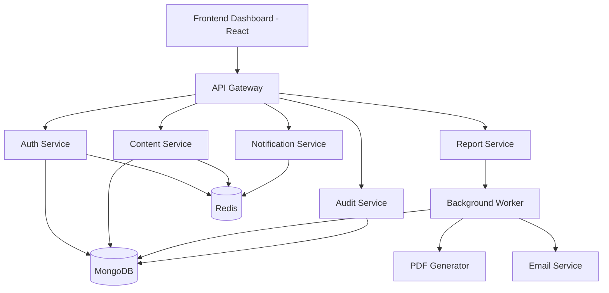

# System Architecture

## Overview

This project implements a **Content Management Dashboard** built using a **microservices architecture**.

The system includes:

- Frontend Dashboard
- API Gateway
- Multiple backend services
- Redis for caching and queues
- MongoDB database
- Worker service for async tasks
- Docker-based infrastructure

The goal is to simulate a **real-world production system architecture** while keeping implementation manageable.

---

# High-Level Architecture

