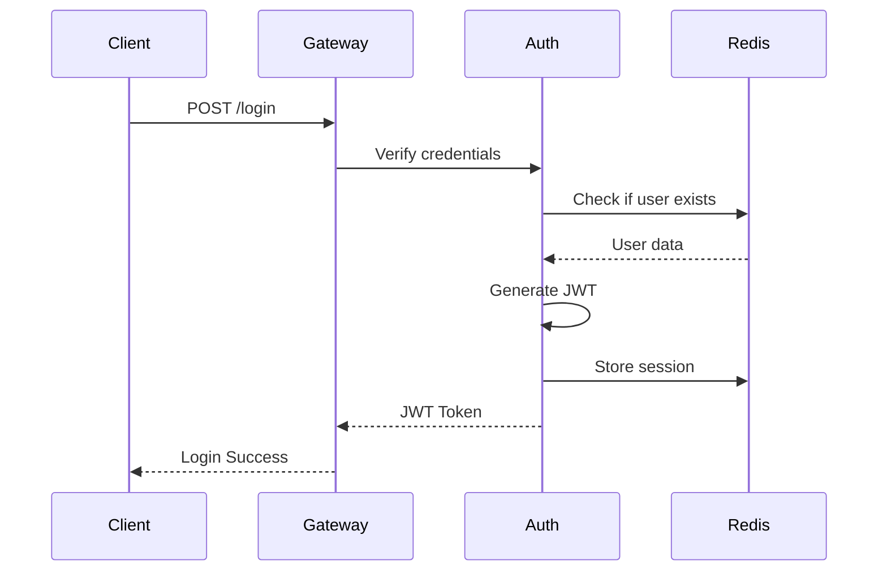

# System Design

## Objective

The goal is to design a **Content Management Dashboard** with:

- Microservice backend
- Redis integration
- API gateway
- Report generation
- Notification system
- Docker deployment

This design prioritizes:

- Modular architecture
- Scalability
- Maintainability
- Production-like patterns

---

# Request Flow

## Login Flow

1. User submits login credentials
2. Request reaches API Gateway
3. Gateway routes request to Auth Service
4. Auth Service verifies credentials
5. JWT token is generated
6. Session stored in Redis
7. Token returned to client

Flow:


## Content Creation Flow

1. User creates content via dashboard
2. Request goes through API Gateway
3. Gateway forwards to Content Service
4. Content Service validates and saves
5. Audit log created
6. Notification sent

Flow:
```
Client
↓
API Gateway
↓
Content Service
↓
Redis Session Store
↓
Return JWT
```
---

# Report Generation Flow

Reports are processed asynchronously.

Steps:

1. User requests report generation
2. Report Service creates job
3. Job pushed to Redis queue
4. Worker processes job
5. PDF generated
6. Email sent to user

Flow:

```
Client
↓
API Gateway
↓
Report Service
↓
Redis Queue
↓
Worker
↓
PDF Generation
↓
Email Delivery
```

---

# Notification System

Notifications are triggered by events.

Examples:

- login alerts
- content created
- report generated

Architecture:

```
Service Event
↓
Redis Queue
↓
Worker
↓
Notification Service
↓
Client
```

Notifications can be delivered using:

- WebSockets
- polling
- email
